---

### 💡 About Me  
🌐 I’m a **Backend Developer** who loves crafting efficient, scalable, and clean systems — but I also explore **Frontend** and **Game Development** to keep my creativity alive.  
🎯 My focus is on building **web applications** and **interactive games** that combine logic, art, and emotion.  
💬 I believe great code isn’t just about performance — it’s about purpose and experience.  

---

### 🛠️ Tech Stack  

<table>
    <tr>
        <td align="center" width="96"> HTML</td>
        <td align="center" width="96"> CSS</td>
        <td align="center" width="96"> JavaScript</td>
        <td align="center" width="96"> Python</td> 
        <td align="center" width="96"> Java</td>
        <td align="center" width="96"> C#</td>
        <td align="center" width="96"> C++</td>
        <td align="center" width="96"> Figma</td>
    </tr>
    <tr>
        <td align="center" width="96"> MySQL</td>
        <td align="center" width="96"> Sqlite</td>
        <td align="center" width="96"> Bootstrap</td>
        <td align="center" width="96"> Node.js</td>                                     <td align="center" width="96"> Laravel</td>
        <td align="center" width="96"> Bash</td>
        <td align="center" width="96"> Git</td>
        <td align="center" width="96"> GitHub</td>
    </tr>
</table>

---

### 🚀 Current Focus  
- ⚙️ Improving backend architecture and API optimization  
- 🕹️ Developing **visual novel & RPG-style games** using Unity + JS  
- 🌍 Building **responsive web apps** for any device  
- 💡 Constantly learning new frameworks & best practices  

---

### 📊 GitHub Stats  

  
      

---

### 🌈 My Vision  
To become a **versatile full-stack developer** who creates digital experiences that inspire and connect — from logic to emotion.  

---

### 📫 Reach Me  

  
  
  

---

  

  <i>“Code with precision, build with purpose, and design with emotion.”</i>

---

  

