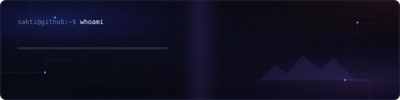

# GitHub Profile README

```md


---

### 💡 About Me

👋 Hi! I'm **Sakti**, a **Full-Stack Developer** who enjoys building things from the ground up — from backend logic and databases to interfaces that people actually interact with.

🌐 My journey started with web development, where I explored both **frontend and backend development**, APIs, databases, and modern web technologies.

🎮 But recently, I've been diving deeper into another world I'm passionate about: **Game Development**. I love the idea of combining programming, systems, art, interaction, and storytelling into an experience that players can explore.

⚡ For me, web development and game development aren't completely separate worlds. Both are about one thing: **turning ideas into interactive experiences.**

---

### 🛠️ Tech Stack

<div align="center">
<table>
    <tr>
        <td align="center" width="96"><br>HTML</td>
        <td align="center" width="96"><br>CSS</td>
        <td align="center" width="96"><br>JavaScript</td>
        <td align="center" width="96"><br>TypeScript</td>
        <td align="center" width="96"><br>Python</td>
        <td align="center" width="96"><br>C#</td>
        <td align="center" width="96"><br>C++</td>
        <td align="center" width="96"><br>Figma</td>
    </tr>

    <tr>
        <td align="center" width="96"><br>React</td>
        <td align="center" width="96"><br>Next.js</td>
        <td align="center" width="96"><br>Node.js</td>
        <td align="center" width="96"><br>PHP</td>
        <td align="center" width="96"><br>Laravel</td>
        <td align="center" width="96"><br>MySQL</td>
        <td align="center" width="96"><br>SQLite</td>
        <td align="center" width="96"><br>Unity</td>
    </tr>

    <tr>
        <td align="center" width="96"><br>Godot</td>
        <td align="center" width="96"><br>Git</td>
        <td align="center" width="96"><br>GitHub</td>
        <td align="center" width="96"><br>GitLab</td>
        <td align="center" width="96"><br>Bash</td>
        <td align="center" width="96"><br>Bootstrap</td>
    </tr>
</table>
</div>

---

### 🚀 Current Focus

Right now, I'm balancing two paths that I want to grow together:

🌐 **Full-Stack Development**
- Building modern and responsive web applications
- Improving backend architecture, APIs, and database design
- Learning more about **Next.js** and **TypeScript**

🎮 **Game Development**
- Exploring game systems, gameplay programming, and interactive mechanics
- Building projects using **Godot and C#**
- Learning how code, art, design, and storytelling can work together
- Working toward creating games with worlds and experiences that feel alive

I'm still exploring, still experimenting, and still figuring out where this journey will take me.

---

### 🧩 What I Enjoy Building

- 🌐 Full-stack web applications
- ⚙️ Backend systems and APIs
- 🗄️ Database-driven applications
- 🎮 Games and interactive experiences
- 🧠 Gameplay systems and mechanics
- 📖 Projects that combine technology with storytelling

---

### 📊 GitHub Stats

<p align="center">
  
  
</p>

---

### 🌈 My Vision

I don't want to limit myself to just one type of development.

My goal is to grow as a **versatile developer** with a strong foundation in full-stack development while continuing to dive deeper into **game development**.

Whether it's a web application, a backend system, or a game world, I want to build things that are not only functional — but also **meaningful, interactive, and memorable**.

---

### 📫 Reach Me

<p align="center">
  <a href="mailto:saktiarif830@gmail.com">
    
  </a>

  <a href="https://www.instagram.com/saktehhhhhhh?igsh=YzV3NHJzc2d1OWFh" target="_blank">
    
  </a>

  <a href="https://github.com/SaktiArifDwiPutra" target="_blank">
    
  </a>
</p>

---

<p align="center">
  
</p>

<p align="center">
  <i>"From systems and logic to worlds and experiences."</i>
</p>

---

<p align="center">
  
</p>
```
